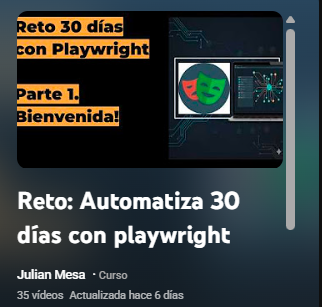
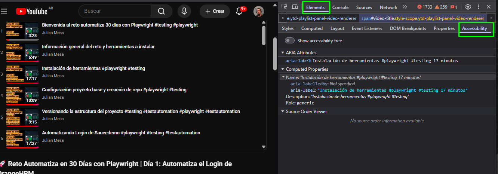

# Playwright Reto 30 días

## [PLAYWRIGHT RETO 30 DIAS (youtube)](https://www.youtube.com/watch?v=Qb-2wHUVVas&list=PLeo6Q1inqlOdzmWkbp0KqG79x2JM1OgzN)

### Video 6 resource: 

[Saucedemo Link](https://saucedemo.com)

### Video 7 resource: 

[Orange HRM](https://opensource-demo.orangehrmlive.com/web/index.php/auth/login)

### last video [Youtube Video 7 - Challenge Day 2](https://www.youtube.com/watch?v=HrwImJ2ciFg&list=PLeo6Q1inqlOdzmWkbp0KqG79x2JM1OgzN&index=7)

## <mark>How to run tests by terminal</mark>

` npx playwright test --grep "<<test name>>" --project="chromium" --headed `

## <mark>TIPS</mark>
## Browser Inspector Tip

- A good tip to use the browser inspector to "select" elements is to use the label "Accessibility" to see the properties of the element selected.

